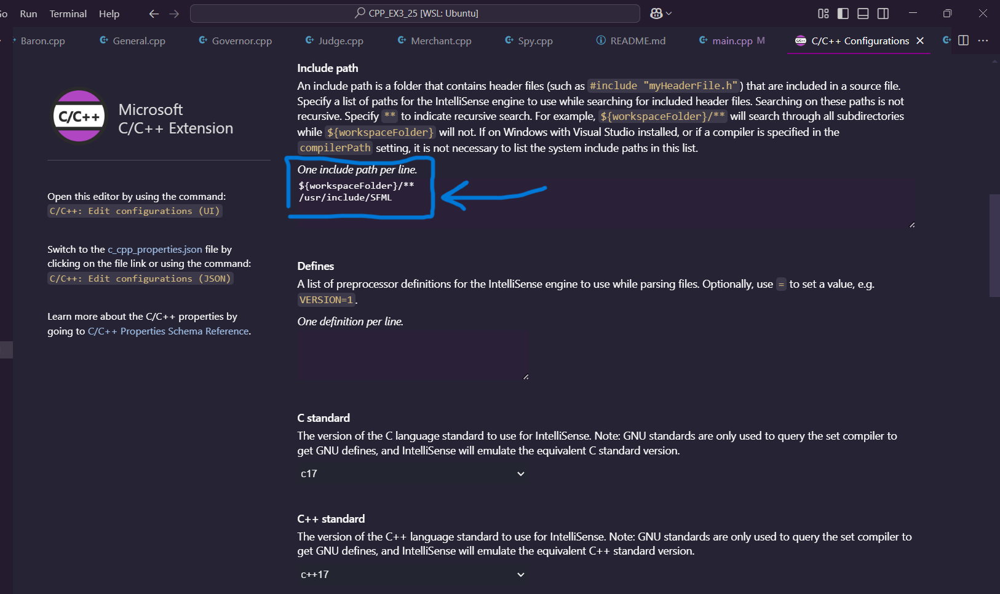

# Fanmade Coup-Inspired Game

A simpler fanmade version of the classic Coup game, designed for 2-6 players. Instead of cards, each player is assigned a unique role that determines their abilities and strategy.

## Game Overview

This game features completely new roles created for this version, except for the Spy role, which is inspired by the expansion Coup: Rebellion G54 (2014).

### Roles
- Baron  
- General  
- Governor  
- Judge  
- Merchant  
- Spy *(from Coup: Rebellion G54 expansion)*

## Installation Instructions (GUI via WSL)

Follow these steps to install the GUI components for running the game under **WSL (Windows Subsystem for Linux)**.

### Step 1: Install X11 and verify GUI support
```bash
sudo apt update
sudo apt install x11-apps
xeyes
```
(this should open a small window with eyes verifying everything is installed correctly)

### Step 2: Install SFML
```bash
sudo apt update
sudo apt install libsfml-dev
```
### Step 3: Configure c_cpp_properties.json
In VS Code, open the Command Palette (Ctrl+Shift+P), then choose: C/C++: Edit Configurations (UI)
Scroll down to the **"Include Path"** section and add the following path **(without quotes)**:  
"/usr/include/SFML"

picture below shows exactly how it should be:


### Step 4: Check what's your current GPU and what driver you have
```bash
sudo apt update
sudo apt install mesa-utils
```

```bash
glxinfo | grep "OpenGL renderer"
```
#### This should output your current GPU's renderer info.

### Step 5: Check Vulkan support (since ZINK relies on Vulkan)
```bash
sudo apt install vulkan-tools
```

```bash
vulkaninfo | less
```
#### Scroll and confirm that Vulkan-capable GPU is detected.

### Step 6: Check your GPU hardware and drivers installed
*For Intel GPUs:

Check that i915 kernel driver is loaded:
```bash
lsmod | grep i915
```

If it’s missing, install or update mesa:
```bash
sudo apt install mesa-utils mesa-vulkan-drivers
```

*For AMD GPUs:

Check that amdgpu kernel driver is loaded:

```bash
lsmod | grep amdgpu
```

If missing, install Mesa drivers:

```bash
sudo apt install mesa-utils mesa-vulkan-drivers
```

*For NVIDIA GPUs:

Check driver:

```bash
nvidia-smi
```

If not found, install NVIDIA proprietary driver:

```bash
sudo ubuntu-drivers autoinstall
```

Then reboot.

### Step 7: Compile the main executable(the demo) and run it
```bash
make all
./main_exe
```

****************************** Will be added here ******************************

## Author

**Yarin Keshet**  
📧 yarinkash1@gmail.com